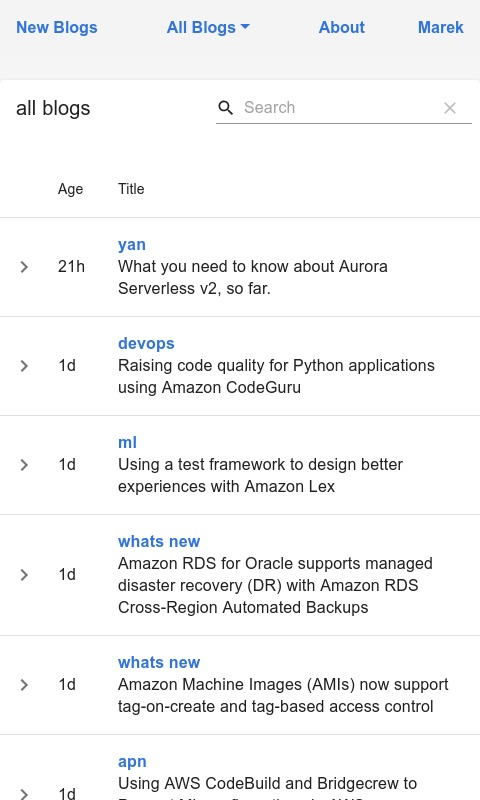

amplify-blog
============

This is the backend of the blog hosted on [marek.rocks](https://marek.rocks). It's deployed using AWS Amplify and uses the Gatsby Starter Theme as a base. The blog content is retrieved using GraphQL from an AppSync endpoint. Searches are performed using Algolia Search.

The backend code for this web service can be found [here](https://github.com/marekq/rss-lambda).

Roadmap
-------

- [X] Add GraphQL support for data retrieval using AppSync.
- [X] Added blog search using Algolia. 
- [X] Reduce build time to under three minutes using a build container.
- [X] Add better search options and add more flexible blog table layout.
- [X] Add AWS blog filtering and searching.
- [X] Add About and Resume pages.
- [X] Optimize website loading performance by reducing page load sizes.

Contact
-------

In case you have any suggestions, questions or remarks, please raise an issue or reach out to @marekq.

